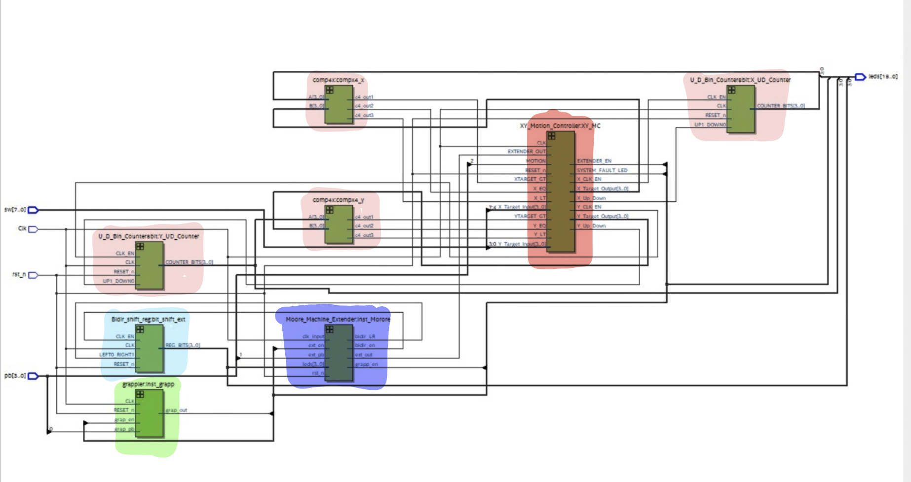
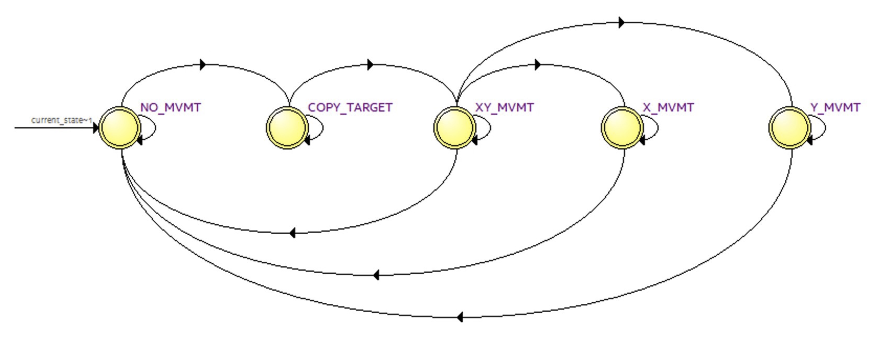

# Claw Machine Controller

## Controller logic implementation using VHDL

- [Claw Machine Controller](#claw-machine-controller)
  - [Controller logic implementation using VHDL](#controller-logic-implementation-using-vhdl)
    - [Overview](#overview)
    - [Features](#features)
  - [Top Level Circuit](#top-level-circuit)
  - [Components](#components)
    - [Comparators](#comparators)
    - [XYMotion Controller](#xymotion-controller)
    - [Extender Controller](#extender-controller)
    - [Grappler Controller](#grappler-controller)
    - [Reset Functionality](#reset-functionality)
  
### Overview
This project implements a claw machine controller using VHDL. The design integrates multiple components to control the claw's X and Y axis movement, enable claw gripping operations, and provide feedback on system status. Users can interact with the machine through push buttons and switches, with the state of the system displayed on LEDs.

### Features

- **Motion Control**: User controlled X and Y axis movement
- **Claw Operation**: Grappler functionality for picking up and releasing objects.
- **Error Detection**: System faults are monitored and displayed via LEDs.

## Top Level Circuit

## Components

### Comparators
A 4 bit comparator is implemented using 4 instances of a 1 bit comparator to compare two 4 bit numbers and set output depending on which is larger or if they are equal.
These are used to determine whether the target position has been reached in the X and Y direction

### XYMotion Controller
Given a target position from the user, this component controls the movement in both directions.

### Extender Controller
- Manages the extension and retraction of the claw using a push-button input.

- Ensures extension only occurs under valid conditions, such as the claw being stationary at the target location.

- Implements a state machine to transition between idle, extending, and retracting states.

### Grappler Controller
- Controls the grappler mechanism for picking up and releasing objects.

- Works in conjunction with the extender controller to enable smooth object manipulation.

- Tracks states for opening, closing, and maintaining grip based on user inputs.

### Reset Functionality
- Ensures the entire system can be reset to its initial idle state, allowing for a fresh start in case of - errors or after completing an operation.
Critical for initializing all components and returning the system to a known stable state.

